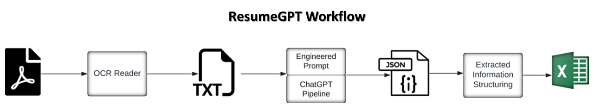

# ResumeGPT

ResumeGPT is a Python package designed to extract structured information from a PDF Curriculum Vitae (CVs)/Resumes documents. It leverages OCR technology and utilizes the capabilities of ChatGPT AI language model (GPT-3.5 and GPT-4) to extract pieces of information from the CV content and organize them in a structured Excel-friendly format.


## Features

- Extracts text from PDF CVs: Uses OCR technology to extract the CV's PDF content as text.
- Extracts information using GPT: Sends the extracted text to GPT for information extraction according to a predefined prompt.
- Structures information to Excel file: Processes the extracted information from GPT and structures it from JSON into a Excel-friendly format.


## Module Overview




1. OCR Reader (CVsReader module): This process reads CVs from a specified directory and extracts the text from PDF files.

2. Engineered Prompt and ChatGPT Pipeline (CVsInfoExtractor module): This process takes as an input the extracted text generated by the OCR Reader and extracts specific information using ChatGPT in a JSON format.

3. Extracted Information Structuring (CVsInfoExtractor module): This process takes the JSON output from the ChatGPT Pipeline, which contains the information extracted from each CV. This information is then structured and organized into a clear and easy-to-understand Excel format.


## Requirements

1. Python: Python 3.8 or newer.

2. GPT-4 API Access: If GPT-3.5 tokens don not fit the CV content, the package uses GPT-4 to extract the information from the CVs, so you'll need an access to the GPT-4 API.


## How to Use

1.	Prepare Your CVs: Make sure all the CVs you want to analyze are in the “CVs” directory.

2.	Run the Script: Run the following scripts. This will clone the project, prepare the environment, and execute the code.
- Clone the project
```bash
git clone https://github.com/Aillian/ResumeGPT.git
```
- CD project directory
```bash
cd ResumeGPT 
```
- Create a virtual environment
```bash
python -m venv resumegpt_venv
```
- Activate the virtual environment
```bash
source resumegpt_venv/Scripts/activate
```
- Upgrade pip version
```bash
pip install --upgrade pip
```
- Install requirements.txt
```bash
pip install -r requirements.txt
```
- CD codes directory
```bash
cd ResumeGPT 
```
- Run main.py and provide the 3 required arguments:
    - CVs Directory Path: use "../CVs" to read from 'CVs' directory
    - Openai API Key: should include GPT-4 model access
    - Desired Positions: written like the following "Data Scientist,Data Analyst,Data Engineer"
```bash
python main.py "../CVs" "sk-ldbuDCjkgJHiFnbLVCJvvcfKNBDFJTYCVfvRedevDdf" "Data Scientist, Data Analyst, Data Engineer"
```

3. Examine the Results: After the script finishes, you will find the output in “Output” directory which are two file (CSV & Excel) of the extracted information from each CV.


## Extracted Information

ResumeGPT is designed to extract 23 features from each CV:

- Education:
1. Education Bachelor University: name of university where bachelor degree was taken
2. Education Bachelor GPA: GPA of bachelor degree (Example: 4.5/5)
3. Education Bachelor Major: major of bachelor degree
4. Education Bachelor Graduation Date: date of graduation from bachelor degree (in format: Month_Name, YYYY)
5. Education Masters University: name of university where masters degree was taken
6. Education Masters GPA: GPA of masters degree (Example: 4.5/5)
7. Education Masters Major: major of masters degree
8. Education Masters Graduation Date: date of graduation from masters degree (in format: Month_Name, YYYY)
9. Education PhD University: name of university where PhD degree was taken
10. Education PhD GPA: GPA of PhD degree (Example: 4.5/5)
11. Education PhD Major: major of PhD degree
12. Education PhD Graduation Date: date of graduation from PhD degree (in format: Month_Name, YYYY)

- Work Experience:
13. Years of Experience: total years of experience in all jobs (Example: 3)
14. Experience Companies: list of all companies that the candidate worked with (Example: [Company1, Company2])
15. Top 5 Responsibilities/Projects Titles: list of top 5 responsibilities/projects titles that the candidate worked on (Example: [Project1, Project2, Project3, Project4, Project5])

- Courses/Certifications:
16. Top 5 Courses/Certifications Titles: list of top 5 courses/certifications titles that the candidate took (Example: [Course1, Course2, Course3, Course4, Course5])

- Skills:
17. Top 3 Technical Skills: list of top 3 technical skills (Example: [Skill1, Skill2, Skill3])
18. Top 3 Soft Skills: list of top 3 soft skills (Example: [Skill1, Skill2, Skill3])

- Employment Status:
19. Current Employment Status: one of the following (Full-time, Part-Time, Intern, Freelancer, Consultant, Unemployed)

- Personal Information:
20. Nationality: nationality of the candidate
21. Current Residence: where the candidate currently live

- Suitable Position:
22. Suitable Position: the most suitable position for the candidate, this will be taken from the user and dynamically replaced in the prompt

- Rating Score:
23. Candidate Rating (Out of 10): score of the candidate suitability for the classified position in point 19 (Example: 7.5)


This information is then organized into a structured Excel file.


## Contributing
Pull requests are welcome. For major changes, please open an issue first to discuss what you would like to change.

Possible additional features and optimizations:
1. Add additional features to the prompt.
2. Handling exceeded tokens limit, by further cleansing cv content.
3. The code tries to call gpt-3.5-turbo model first, if token limit exceeds the acceptable limit, it calls gpt-4. But this has some problems: 1- it is costly 2- what if the provided API key does not have access to gpt-4 model?
4. Catching GPT-4 "service is down" error by calling the API again after some sleeping time.
5. Can the prompt be reduced so we save some tokens for the cv content?
6. Separating "Information To Extract" in the prompt to a different file so the user gets the flexibility of adding new features and then dynamically imputing it into the prompt after that the added features in "CVs_Info_Extracted.csv" should be reflected as column names in the csv file.
7. Additional errors handling.
8. What about extending the usage to other LLMs?


## License
ResumeGPT is released under the MIT License. See the LICENSE file for more details.